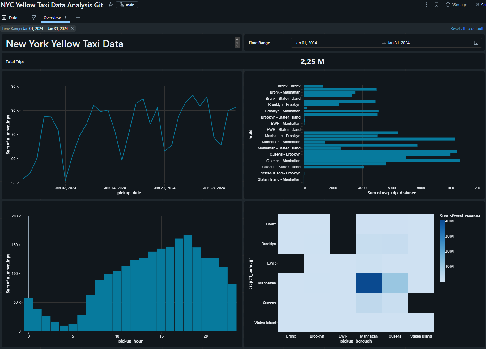
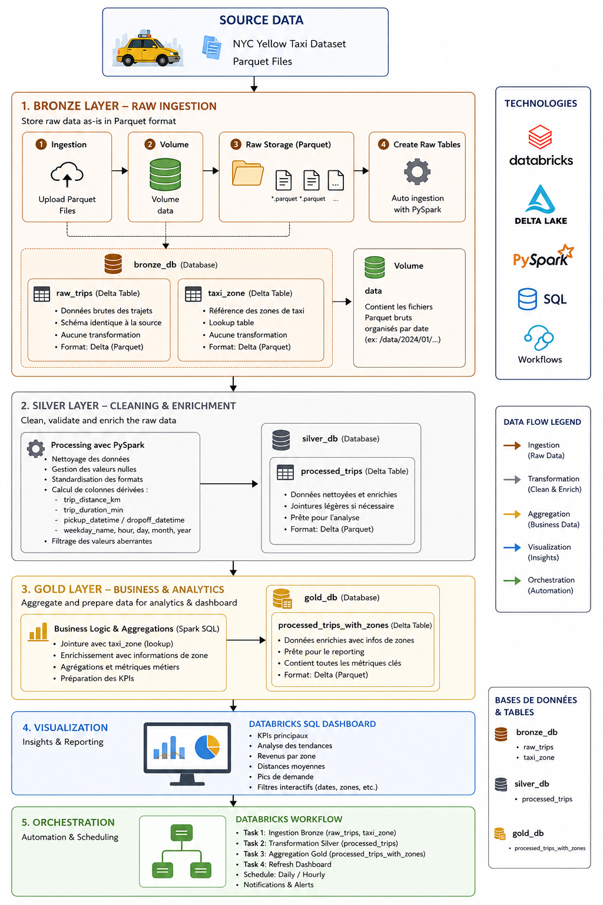

````markdown
# 🚖 NYC Yellow Taxi Analytics avec Databricks

> Pipeline **Data Engineering** de bout en bout construit avec **Databricks**, mettant en œuvre une architecture **Medallion (Bronze → Silver → Gold)** afin de transformer des données brutes en indicateurs métier exploitables.

---

# 📊 Aperçu du Dashboard



---

# 🏗️ Architecture



---

# 🎯 Objectifs du projet

L'objectif de ce projet est de construire un pipeline de données moderne permettant de :

- Ingérer des fichiers Parquet dans un environnement Lakehouse.
- Stocker les données brutes dans une couche Bronze.
- Nettoyer et enrichir les données avec PySpark.
- Construire une couche Gold prête pour l'analyse.
- Automatiser l'ensemble du pipeline avec Databricks Workflows.
- Mettre à disposition un Dashboard interactif destiné aux utilisateurs métier.

---

# 🛠️ Stack technique

| Technologie | Utilisation |
|-------------|-------------|
| Databricks | Plateforme Data Engineering |
| Unity Catalog | Gouvernance des données |
| Delta Lake | Stockage des tables |
| PySpark | Transformations |
| Spark SQL | Agrégations |
| Databricks SQL | Dashboard |
| Databricks Workflows | Orchestration |
| Git / GitHub | Versionning |

---

# 🏛️ Architecture Medallion

```text
                NYC Yellow Taxi Dataset
                     (Parquet Files)
                            │
                            ▼
                     Volume (data)
                            │
                            ▼
                     bronze_db
                            │
                            ▼
                     silver_db
                            │
                            ▼
                      gold_db
                            │
                            ▼
               Databricks SQL Dashboard
                            │
                            ▼
               Databricks Workflows
````

---

# 🥉 Bronze Layer

La couche **Bronze** est dédiée à l'ingestion des données brutes.

Les fichiers Parquet sont déposés dans un **Volume Unity Catalog** puis chargés dans des tables Delta sans aucune transformation.

## Base de données

```text
bronze_db
```

## Volume

```text
data
```

## Tables

| Table     | Description                                |
| --------- | ------------------------------------------ |
| raw_trips | Données brutes des trajets NYC Yellow Taxi |
| taxi_zone | Table de correspondance des zones de taxi  |

### Caractéristiques

* Conservation des données sources
* Aucune transformation
* Format Delta Lake
* Historisation des données

---

# 🥈 Silver Layer

La couche **Silver** applique les traitements de nettoyage et d'enrichissement.

## Base de données

```text
silver_db
```

## Table

| Table           | Description                    |
| --------------- | ------------------------------ |
| processed_trips | Données nettoyées et enrichies |

### Transformations réalisées

* Suppression des valeurs incohérentes
* Gestion des valeurs nulles
* Normalisation des données
* Création de la colonne `weekday_name`
* Création de la colonne `route`
* Validation des données

---

# 🥇 Gold Layer

La couche **Gold** contient les données prêtes pour la consommation métier.

## Base de données

```text
gold_db
```

## Table

| Table                      | Description                                                       |
| -------------------------- | ----------------------------------------------------------------- |
| processed_trips_with_zones | Table analytique enrichie avec les informations des zones de taxi |

Cette table est utilisée directement par le Dashboard Databricks SQL.

---

# ⚙️ Workflow

Le pipeline est entièrement automatisé grâce à **Databricks Workflows**.

Le workflow exécute les étapes suivantes :

1. Chargement des fichiers Parquet.
2. Création des tables Bronze.
3. Nettoyage des données.
4. Création de la table Silver.
5. Enrichissement avec les zones de taxi.
6. Création de la table Gold.
7. Rafraîchissement du Dashboard.


---

# 📈 Dashboard

Le Dashboard permet d'analyser les données selon plusieurs indicateurs :

* Nombre de trajets
* Répartition des trajets par jour
* Répartition horaire
* Distance moyenne
* Analyse des revenus
* Analyse des zones de prise en charge
* Analyse des zones de dépose
* Pics de fréquentation

---

# 📂 Structure du projet

```text
nyc-yellow-taxi-analytics/
│
├── notebooks/
├── sql/
├── data/
├── images/
│   ├── architecture.png
│   ├── workflow.png
│   ├── dashboard.png
│   ├── catalog bronze.png
│   ├── catalog silver.png
│   ├── catalog gold.png
│
├── README.md
```

---

# 💼 Compétences mises en œuvre

* Architecture Medallion
* Data Engineering
* ETL / ELT
* Delta Lake
* Unity Catalog
* PySpark
* Spark SQL
* Databricks SQL
* Databricks Workflows
* Dashboarding
* Git & GitHub

---

# 📌 Résultats métier

Ce pipeline transforme un ensemble de données brutes en informations exploitables par les équipes métier.

Le Dashboard permet notamment de répondre aux questions suivantes :

* 📈 Quels sont les jours et les heures où la demande est la plus importante ?
* 💰 Quelles zones génèrent le plus de revenus ?
* 🚖 Quels sont les itinéraires les plus empruntés ?
* 📏 Quelle est la distance moyenne des trajets ?
* 📊 Comment évolue l'activité au fil du temps ?

Ces analyses permettent notamment de :

* Optimiser le positionnement des véhicules en fonction de la demande.
* Identifier les zones les plus rentables.
* Anticiper les périodes de forte affluence.
* Faciliter la prise de décision grâce à des indicateurs fiables et automatisés.

Ce projet illustre la mise en place d'un pipeline Data Engineering moderne capable de transformer des données brutes en informations à forte valeur ajoutée pour les métiers.

```
```
